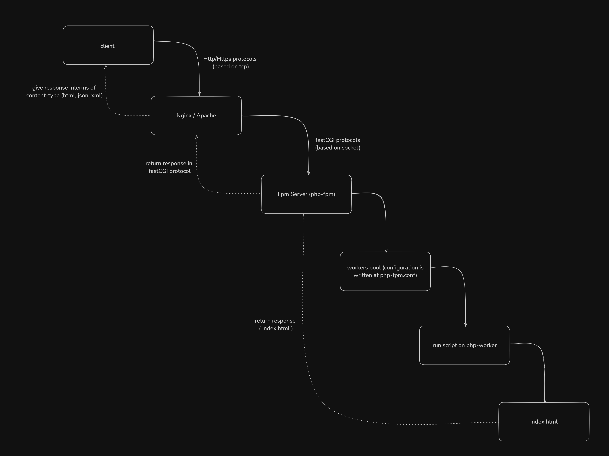

# Questions

\

 1. What is a fastCGI?
    * FastCGI (Fast Common Gateway Interface) is a protocol that improves the performance of web applications by handling requests more efficiently compared to the older CGI (Common Gateway Interface) standard. CGI allowed web servers to interact with external programs or scripts to generate dynamic content, but it had a significant limitation: each request to the web server would start a new process, causing high overhead and slower performance. FastCGI addresses this by creating a persistent process for handling requests, reducing the need to start a new process each time.

      Here's how FastCGI works and why it's beneficial:

      
      1. **Persistent Processes**: FastCGI processes remain running in the background, ready to handle requests as they come in. This means that instead of starting a new process for each HTTP request, the same process can be reused, which significantly reduces the overhead.
      2. **Multiplexing**: FastCGI allows multiple requests to be sent through a single connection, which can handle multiple simultaneous interactions without creating a bottleneck.
      3. **Language Flexibility**: FastCGI is compatible with various programming languages, such as PHP, Python, and Ruby, making it adaptable for a wide range of applications.
      4. **Improved Performance and Scalability**: Because it reduces the creation of new processes, FastCGI allows for faster response times and more efficient use of server resources, making it suitable for high-traffic websites and scalable systems.

      ### Common Use Cases
      * **Web servers with high traffic**: FastCGI is commonly used with web servers like Apache, NGINX, and Lighttpd to serve dynamic content faster.
      * **PHP applications**: Often used in conjunction with PHP (especially in setups where NGINX is the web server), FastCGI improves performance by offloading PHP processes from the web server itself.

      ### Example Scenario

      If you're running a PHP application on NGINX, FastCGI can be used to handle PHP requests by forwarding them to `php-fpm` (PHP FastCGI Process Manager). NGINX sends requests to `php-fpm`, which processes them and sends back the response to NGINX, which then serves it to the client.

      Would you like more detail on FastCGI configurations or examples for specific web servers?
 2. How is it related to PHP? The life cycle of the request
    * 
 3. How laravel application load during a request?
    * In a Laravel application, the process of request handling and application initialization relies heavily on **autoloading**, the **service container**, and **service providers**. Let's walk through each of these components, especially in the context of handling a request like `abc.com/example/1`.

      ### 1. Autoloading

      **Autoloading** is a mechanism that loads PHP classes automatically without needing to manually include or require files. This is especially useful as it helps Laravel manage and load hundreds of classes as needed.

      In Laravel, autoloading is achieved through **Composer**. When you run `composer install` or `composer dump-autoload`, Composer creates an `autoload.php` file in the `vendor` directory. Laravel loads this file in `index.php` to include all dependencies and classes. The autoloading mechanism allows Laravel to load:
      * Core Laravel classes (from `vendor`).
      * Any additional packages.
      * Application-specific classes in `app/` (like Controllers, Models, etc.).

      ### 2. Laravel Request Lifecycle – Initialization and Handling

      When a client sends a GET request like `abc.com/example/1`, here's a high-level flow of how Laravel initiates and handles the request:

      #### Step 1: Public Directory and `index.php`
      * The **web server** (e.g., Nginx or Apache) receives the request and directs it to Laravel's `public/index.php` file. This is Laravel's **front controller**, responsible for bootstrapping the application.
      * `index.php` loads Composer's autoload file (`vendor/autoload.php`), allowing access to all the classes.
      * Laravel is then instantiated by bootstrapping the framework, primarily through `Illuminate\Foundation\Application`.

      #### Step 2: Bootstrapping the Application
      * The `index.php` file calls Laravel's core bootstrap files, which include configuration loading and environment settings.
      * It then creates an instance of the **application container** (an `Application` class instance), which acts as a central registry for all service bindings and dependencies.

      ### 3. Service Container and Dependency Management

      The **service container** is an essential part of how Laravel manages dependencies:
      * As the application is bootstrapped, the service container begins to **bind interfaces to their concrete implementations**. For instance, if a Controller requires the `Logger` interface, the service container knows which implementation to provide.
      * The service container is initialized with **bindings for core Laravel services** (like routing, HTTP handling, and caching), enabling dependency injection throughout the application.

      #### Step 4: Route Resolution
      * After setting up essential services, Laravel checks **routes** to determine which controller and action to call.
      * When Laravel encounters the URL path `/example/1`, it looks up the corresponding route in `routes/web.php`.
      * Based on the route definition, Laravel determines the correct **controller** and **method** to handle the request.

      ### 4. Role of Service Providers (e.g., `AppServiceProvider`)

      **Service Providers** are central to the setup process in Laravel. Each service provider:
      * **Registers services**: Defines the services and bindings that the application needs. For example, the `AppServiceProvider` in `app/Providers` is a place to register custom bindings or any application-specific logic.
      * **Bootstraps services**: Service providers contain a `boot` method, where you can initialize services or perform tasks after all services are registered. This is where you might perform custom logic, like setting up a default timezone, configuring logging, or any other tasks that need to run before the request is fully processed.

      When a request hits the application, service providers that are specified in `config/app.php` are registered and booted by the service container to ensure all essential services are ready for the request.

      ### 5. Handling the Request and Sending the Response
      * Once the correct controller and method are determined, the **service container** injects dependencies (like request data, models, or other services) into the controller.
      * The controller processes the request and returns a **response**. This response might involve querying the database, applying business logic, and returning a view or JSON data.
      * Finally, Laravel sends the response back through the HTTP layer to the client.

      ### Full Example Flow: `abc.com/example/1`

      
      1. **Request Arrival**: Client sends GET request to `abc.com/example/1`.
      2. **Front Controller**: `index.php` loads Laravel and the Composer autoload file.
      3. **Application Bootstrapping**: The application instance is created, and essential components are registered.
      4. **Service Providers**: Providers like `AppServiceProvider` are registered and booted, preparing services and bindings.
      5. **Route Matching**: Laravel routes the request to `ExampleController@show` (assuming that's the specified controller in `web.php`).
      6. **Service Container Injection**: The container injects any dependencies required by `ExampleController@show`.
      7. **Response Generation**: The controller processes the request, returning a view or JSON.
      8. **Response Sending**: Laravel sends the HTTP response back to the client.

      ### Summary

      The combination of autoloading, the service container, and service providers makes Laravel efficient in handling requests. **Autoloading** provides the framework and application dependencies, **service providers** register the services and configuration, and the **service container** manages dependency injection, allowing Laravel to handle requests dynamically.
 4. These things are repeated during the life cycle which is for the initial purpose.
    * No, all the bootstrapping, autoloading, and service registration in Laravel does not repeat for every request in a PHP-FPM pool connection. PHP-FPM pools are designed to reduce this redundancy. Here's how it works:

      
      1. **Persistent PHP-FPM Workers**:
         * When PHP-FPM starts, it spawns a set number of worker processes (in this case, 20 as per your configuration). Each worker is initialized with its own copy of PHP, which will handle multiple requests over its lifetime.
         * For each request, a single worker is responsible for handling the lifecycle, from receiving the request to sending the response. Once a worker finishes handling a request, it's free to accept another request without restarting or reloading everything.
      2. **Bootstrapping and Autoloading in PHP-FPM**:
         * Each worker does **not repeat all bootstrapping for every request**. The autoload file and classes remain loaded in memory for each worker process, meaning they don't need to reload unless there is a code or configuration change.
         * Once a worker is loaded with Laravel's framework, core files, and service container, this state remains loaded for all subsequent requests handled by that worker.
      3. **Bindings and Service Providers**:
         * Laravel's **service bindings and singletons** are configured during the initial bootstrapping and remain in memory for that worker process.
         * Certain bindings (like configuration and singleton services) do not need to be re-registered on every request—they are persistent across requests within the worker.
         * Only **request-specific dependencies** (like the current request object, route, and any session data) are handled fresh with each new request.
      4. **Caching**:
         * Laravel also optimizes its startup by allowing caching of configuration and route files, reducing the need for each worker to repeatedly load routes and configuration.

      ### In Summary

      PHP-FPM workers reduce redundant bootstrapping by:
      * Persisting the loaded framework, classes, and service bindings in memory for each worker.
      * Only repeating request-specific processing (like route matching and response generation) for each incoming request.

      So, the overhead of full initialization occurs **once per worker** (up to 20 times initially) but not on every request handled by each worker, making PHP-FPM efficient for handling high request loads without repeated reinitialization.
 5. full request lifecycle for laravel application
    * Certainly! Here's a step-by-step path through Laravel's full lifecycle, from initial bootstrapping to handling a request and delivering a response. We'll use the example of a GET request to `abc.com/example/1`, which hypothetically retrieves some data from the database.

      ### 1. HTTP Request Received by Web Server
      * **Client Request**: A user navigates to `https://abc.com/example/1`.
      * **Web Server (Nginx/Apache)**: The server receives the HTTP request and, since this is a PHP request, it passes the request to **PHP-FPM** using the FastCGI protocol.

      ### 2. PHP-FPM Executes `index.php`
      * **Front Controller (**`index.php`): The entry point of all requests is `public/index.php`, where the Laravel application lifecycle starts.
      * **Composer Autoloading**: `index.php` first loads Composer's autoload file (`vendor/autoload.php`), bringing in all classes and dependencies, including third-party packages and core Laravel classes.

      ### 3. Application Bootstrap (Core Initialization)
      * **Application Instance**: Laravel creates a new instance of the `Application` class, which acts as a service container to manage all components and dependencies.
      * **Load Essential Configurations**: Laravel's `bootstrap/app.php` file is loaded, setting up essential configurations like environment settings, paths, and bindings for core services.
      * **Service Providers Registration**: The application registers all **service providers** (listed in `config/app.php`), which contain code to initialize different parts of the application, like database connections, caching, and logging. This happens during the **bootstrapping** phase but is only done once per PHP-FPM worker.

      ### 4. Service Providers (e.g., `AppServiceProvider`) and Database Connection Initialization
      * **AppServiceProvider**: This is one of the service providers defined in `app/Providers/AppServiceProvider.php`. Here, any custom service bindings and logic are registered.
      * **Database Connection Initialization**: Laravel initializes the database connection here using the configuration in `config/database.php`.
        * By default, Laravel does not open a database connection immediately. Instead, it uses **lazy loading**—meaning the connection is only established when the database is first accessed (such as by querying a model in the controller).

      ### 5. Middleware Execution
      * **Global Middleware**: Laravel next goes through **global middleware** (defined in `app/Http/Kernel.php`), which can handle tasks like session start, checking CSRF tokens, and more.
      * **Route Middleware**: Middleware specific to the route or group of routes is also executed at this point.

      ### 6. Route Matching and Controller Resolution
      * **Route Matching**: Laravel uses the route definitions in `routes/web.php` (for web requests) to find a route that matches `/example/1`.
      * **Controller Resolution**: If the route points to a controller, such as `ExampleController@show`, Laravel will instantiate this controller. Here, **dependency injection** takes place: the service container injects any dependencies that the controller's `__construct` method requires.

      ### 7. Controller Action Execution
      * **Action Execution**: Laravel now executes the `show` method in `ExampleController`.
      * **Lazy Database Connection**: Suppose `show` method calls a database model, such as `Example::find(1)`. At this moment:
        * Laravel will initiate a database connection if it hasn't done so already.
        * A query is executed to retrieve data from the database.
      * **Response Creation**: The controller returns a response, which could be a view or JSON data, based on the request type and what the `show` method returns.

      ### 8. Response Preparation and Return
      * **View Rendering**: If the controller returns a view, Laravel compiles the view (if it's not already cached) and prepares the HTML response.
      * **HTTP Response Preparation**: Laravel packages the response, setting the appropriate HTTP headers (like content type and status code).
      * **Middleware Post-Processing**: Certain middleware (like `TerminateMiddleware`) might execute after the response is generated but before it's sent to the client.

      ### 9. Sending the Response to the Client
      * **PHP-FPM to Web Server**: Laravel sends the completed response back to PHP-FPM, which in turn passes it back to the web server.
      * **Web Server to Client**: The web server then sends the final HTTP response back to the client over HTTPS.

      ### Summary of the Laravel Lifecycle for `abc.com/example/1`

      
      1. **HTTP Request**: Client sends a GET request to the server.
      2. **PHP-FPM Bootstrapping**: The server routes to `index.php`, bootstrapping the application.
      3. **Service Container Initialization**: Laravel's application instance is created, registering service providers and core bindings.
      4. **Middleware Execution**: Global and route-specific middleware are executed.
      5. **Route Matching and Controller Resolution**: The route is matched, and the controller (with dependencies) is instantiated.
      6. **Database Connection Lazy Initialization**: If the controller queries the database, a connection is initiated.
      7. **Response Creation**: The controller action returns a response (like a view or JSON).
      8. **Middleware Post-Processing**: Any final middleware tasks are performed.
      9. **Response Delivery**: PHP-FPM sends the response to the web server, which forwards it to the client.

      This flow ensures Laravel applications are both modular and efficient in handling requests, using lazy loading and persistent PHP-FPM workers to optimize performance.
 6. What is the meaning of app() helper how it used in laravel echo system.
    * In Laravel, `app(X::class)` and `app(Y::class)` are calls to resolve instances of specific classes from the **service container**. Here's what they mean and how they're used:

      ### Understanding `app()` in Laravel

      The `app()` helper function is a shortcut to access Laravel's **service container**. It essentially asks Laravel to give you an instance of the class you specify.
      * `app(X::class)` will return an instance of `X` that has been registered in the service container.
      * `app(Y::class)` will return an instance of `Y`, also pulled from the container.

      When you use `app(SomeClass::class)`, Laravel will:
      * Check if `SomeClass` is already bound in the container. If it is, Laravel returns the existing instance (or creates it if it's a singleton).
      * If it's not bound, Laravel will try to automatically **resolve it**, meaning Laravel will try to instantiate it, taking care of any dependencies it has (like any parameters or other classes it needs to function) through **dependency injection**.

      ### Example in Code

      Let's say you have two classes, `X` and `Y`, which depend on each other.

      ```php
      
      class X {
          public function doSomething() {
              return 'Doing something in X';
          }
      }
      
      class Y {
          protected $x;
          
          public function __construct(X $x) {
              $this->x = $x;
          }
          
          public function execute() {
              return $this->x->doSomething();
          }
      }
      ```

      You can resolve them using `app()` like this:

      ```php
      $x = app(X::class); // returns an instance of X
      
      echo $x->doSomething(); // Outputs: Doing something in X
      
      $y = app(Y::class); // returns an instance of Y with an instance of X automatically injected
      
      echo $y->execute(); // Outputs: Doing something in X
      ```

      Here:
      * `app(X::class)` resolves an instance of `X`.
      * `app(Y::class)` resolves an instance of `Y`, injecting `X` as a dependency.

      ### When and Why to Use `app()`

      You would typically use `app()` when:

      
      1. **Manually Resolving Dependencies**: You need an instance of a class that isn't directly injected into the method or class.
      2. **Fetching Bound Instances**: If a class has been **bound with specific configuration** in the service provider, using `app()` ensures you get that configured instance.
      3. **Testing and Flexibility**: Using the service container allows for easier testing, as you can change bindings without changing the code everywhere `app()` is used.

      ### Service Binding Example

      If you bind `X` and `Y` in a service provider, `app()` will resolve them as configured.

      ```php
      
      public function register()
      {
          $this->app->singleton(X::class, function ($app) {
              return new X();
          });
          
          $this->app->singleton(Y::class, function ($app) {
              return new Y($app->make(X::class));
          });
      }
      ```

      Now, calling `app(X::class)` or `app(Y::class)` will return the bound instances.
 7. binding vs dependancy injection
    * In general terms:
      * **Binding** is the process of associating (or "binding") a class, interface, or functionality to a specific implementation within a container or registry. This means that whenever a particular service or dependency is requested, the container knows what to provide.
      * **Dependency Injection (DI)** is a design pattern where an object's dependencies are provided (or "injected") by an external entity (often a framework or a container) rather than the object itself creating its own dependencies. This promotes flexibility, testability, and reduces hard coupling between classes.

      ### Binding and Dependency Injection in Laravel

      Laravel uses the **service container** to manage bindings and dependency injection. The service container is responsible for:

      
      1. **Registering (or Binding) services**: It stores and manages class bindings and instances that the application needs.
      2. **Injecting Dependencies**: It automatically injects (provides) required dependencies into classes when they are needed.

      #### 1. Binding in Laravel

      In Laravel, **binding** is the process of telling the service container how to resolve a specific class or interface.
      * For example, you might bind an interface to a specific implementation so that every time Laravel needs an instance of that interface, it knows which class to use.
      * Bindings are often defined in service providers, such as `AppServiceProvider`, using the `bind()` or `singleton()` methods.

      **Example**: Suppose we have an interface `PaymentGatewayInterface` and an implementation class `StripePaymentGateway`.

      ```php
      
      interface PaymentGatewayInterface {
          public function charge($amount);
      }
      
      class StripePaymentGateway implements PaymentGatewayInterface {
          public function charge($amount) {
              // Stripe-specific logic to charge $amount
          }
      }
      ```

      In a service provider (like `AppServiceProvider`), you would bind this interface to the implementation:

      ```php
      
      public function register() {
          $this->app->bind(PaymentGatewayInterface::class, StripePaymentGateway::class);
      }
      ```

      This tells Laravel: "Whenever `PaymentGatewayInterface` is required, provide an instance of `StripePaymentGateway`."

      #### 2. Dependency Injection in Laravel

      **Dependency Injection (DI)** in Laravel is how classes receive their dependencies from the service container. Laravel automatically injects dependencies wherever they are needed, such as in controller constructors, method parameters, or any place the container resolves a class.

      When a class needs a dependency, Laravel checks if the dependency is already registered (bound) in the service container. If it is, Laravel provides that dependency automatically.

      **Example**: Imagine a `PaymentController` that needs to use `PaymentGatewayInterface` to process payments. Instead of instantiating `StripePaymentGateway` manually, Laravel injects it as a dependency.

      ```php
      
      class PaymentController extends Controller {
          protected $paymentGateway;
          
          public function __construct(PaymentGatewayInterface $paymentGateway) {
              $this->paymentGateway = $paymentGateway;
          }
          
          public function processPayment($amount) {
              $this->paymentGateway->charge($amount);
          }
      }
      ```

      When Laravel creates an instance of `PaymentController`, it will:

      
      1. Check the constructor parameters.
      2. See that it needs an instance of `PaymentGatewayInterface`.
      3. Refer to the binding registered in the service container.
      4. Inject an instance of `StripePaymentGateway` automatically.

      #### Summary

      In Laravel:
      * **Binding**: Registers classes, interfaces, and configurations in the service container, allowing Laravel to know what to provide when a dependency is requested.
      * **Dependency Injection**: Allows Laravel to automatically provide the necessary dependencies to classes, making code modular, easier to test, and more flexible.

      This is a core part of Laravel's architecture, enabling loose coupling and easy configuration across applications.
 8. In which condition dependency injection could be failed
    * Dependency Injection (DI) can fail in Laravel (or any DI-based system) for several reasons, typically when there are issues with the way dependencies are configured, bound, or expected. Here are common scenarios where DI can fail in Laravel, along with examples:

      ### 1. **Unregistered Dependency**
      * **Problem**: If a class or interface is not bound in the container, Laravel won't know what to inject, and dependency resolution will fail.
      * **Example**: Suppose we have a controller that expects an implementation of `PaymentGatewayInterface`, but this interface has not been bound to any class.

        ```php
        class PaymentController extends Controller {
            public function __construct(PaymentGatewayInterface $paymentGateway) {
                $this->paymentGateway = $paymentGateway;
            }
        }
        ```
        * **Error**: When Laravel tries to instantiate `PaymentController`, it will throw a **BindingResolutionException** because it doesn't know how to resolve `PaymentGatewayInterface`.
        * **Solution**: Bind the interface to a concrete class in a service provider, like so:

          ```php
          public function register() {
              $this->app->bind(PaymentGatewayInterface::class, StripePaymentGateway::class);
          }
          ```

      ### 2. **Missing or Incorrect Constructor Parameters**
      * **Problem**: If a class's constructor has required parameters that are not type-hinted or are not automatically resolvable, Laravel cannot inject them.
      * **Example**: If a class has a non-type-hinted parameter in its constructor, Laravel won't know what to inject.

        ```php
        class OrderService {
            public function __construct($orderId) {
                $this->orderId = $orderId;
            }
        }
        ```

        When trying to resolve `OrderService` with `app(OrderService::class)`, Laravel will fail since `$orderId` doesn't have a type hint that the container can recognize.
        * **Error**: Laravel will throw an **ArgumentCountError** or **BindingResolutionException**.
        * **Solution**: Either provide a default value, or refactor to use a type-hinted parameter that Laravel can resolve:

          ```php
          public function __construct(int $orderId) {
              $this->orderId = $orderId;
          }
          ```

      ### 3. **Circular Dependencies**
      * **Problem**: Circular dependencies occur when two classes depend on each other, creating an infinite loop in dependency resolution.
      * **Example**: Suppose `ClassA` depends on `ClassB`, and `ClassB` also depends on `ClassA`.

        ```php
        class ClassA {
            public function __construct(ClassB $classB) {
                $this->classB = $classB;
            }
        }
        
        class ClassB {
            public function __construct(ClassA $classA) {
                $this->classA = $classA;
            }
        }
        ```
        * **Error**: Laravel will throw a **BindingResolutionException** because it can't resolve either class without going into an infinite loop.
        * **Solution**: Refactor your dependencies to remove the circular reference, or consider injecting dependencies in methods instead of constructors if possible.

      ### 4. **Binding Abstract Classes or Interfaces without Implementation**
      * **Problem**: If an interface or abstract class is injected without binding it to a concrete implementation, Laravel cannot resolve it.
      * **Example**: If a controller expects `LoggerInterface`, but no concrete implementation of this interface is bound, Laravel won't know what to inject.

        ```php
        class MyController {
            public function __construct(LoggerInterface $logger) {
                $this->logger = $logger;
            }
        }
        ```
        * **Error**: **BindingResolutionException** occurs, as Laravel doesn't know what implementation to provide.
        * **Solution**: Bind `LoggerInterface` to a concrete class:

          ```php
          $this->app->bind(LoggerInterface::class, FileLogger::class);
          ```

      ### 5. **Improper Singleton Binding**
      * **Problem**: If a dependency is bound as a singleton but has unresolved dependencies of its own, it can lead to errors when multiple requests try to resolve it.
      * **Example**: Suppose `ReportGenerator` is bound as a singleton but depends on `UserRepository` which has not been correctly resolved.

        ```php
        $this->app->singleton(ReportGenerator::class);
        ```
        * **Error**: **BindingResolutionException** or unexpected behaviour due to partially resolved dependencies.
        * **Solution**: Ensure that all dependencies for singletons are properly registered in the container before the singleton is requested.

      ### Summary

      Dependency Injection fails in Laravel when:

      
      1. **Unregistered dependencies** are requested.
      2. **Incorrect constructor parameters** prevent resolution.
      3. **Circular dependencies** create an infinite loop.
      4. **Interfaces or abstract classes** are not bound to concrete implementations.
      5. **Singleton bindings** have unresolved dependencies.

      Resolving these issues typically involves checking that dependencies are registered correctly, removing circular dependencies, and ensuring that all dependencies are type-hinted and bound in the service container.
 9. How actually laravel work aschronously ? how event dispatch, job dispatch and brodcasting work with laravel.
    * \
10. Types of attckes on software reques.

    Sure! There are many types of attacks on software systems, and understanding them is crucial for building secure applications. Here's a broad list of common software attacks, categorized by their nature:

    ### 1. **Denial of Service (DoS) and Distributed Denial of Service (DDoS) Attacks**
    * **DoS**: The attacker floods the system with traffic or requests, overwhelming it and making it unavailable for legitimate users.
    * **DDoS**: A distributed form of DoS where the attack is launched from multiple systems, often part of a botnet, to amplify the impact.

    ### 2. **Injection Attacks**
    * **SQL Injection**: The attacker inserts or manipulates SQL queries through user input to interact with the database in unauthorized ways (e.g., accessing or modifying sensitive data).
    * **Command Injection**: The attacker injects system commands into a vulnerable application, causing it to execute unauthorized commands on the server.
    * **LDAP Injection**: Similar to SQL injection but targeting LDAP (Lightweight Directory Access Protocol) queries to manipulate or access directory data.
    * **XML Injection**: The attacker manipulates XML data to inject malicious content or alter the behavior of a system that processes XML.
    * **OS Command Injection**: Malicious input is used to execute arbitrary operating system commands, compromising the system.

    ### 3. **Cross-Site Attacks (XSS)**
    * **Stored XSS**: Malicious JavaScript code is injected into a website's database and stored, later being executed when users access the page.
    * **Reflected XSS**: The malicious script is reflected off a web server in an error message, search result, or another response, then executed in the user's browser.
    * **DOM-based XSS**: The attack occurs when the vulnerability is in the client-side code (JavaScript), which manipulates the DOM (Document Object Model) and executes the malicious script.

    ### 4. **Buffer Overflow Attacks**
    * This attack occurs when an attacker writes more data to a buffer than it can hold, causing memory corruption. It can allow the attacker to execute arbitrary code or crash the application.

    ### 5. **Authentication & Authorization Attacks**
    * **Brute Force Attack**: The attacker tries every possible combination of usernames and passwords until the correct one is found.
    * **Credential Stuffing**: Using previously leaked username and password pairs (often from other breaches) to gain unauthorized access.
    * **Session Hijacking**: The attacker steals or predicts a valid session token to impersonate the victim.
    * **Man-in-the-Middle (MITM)**: The attacker intercepts and possibly alters the communication between two parties.
    * **Privilege Escalation**: The attacker gains higher-level access to a system or application, allowing them to perform unauthorized actions.

    ### 6. **Cross-Site Request Forgery (CSRF)**
    * The attacker tricks the victim into performing an unintended action on a website where the user is authenticated, such as changing account settings or making a transaction.

    ### 7. **Phishing and Social Engineering**
    * **Phishing**: The attacker impersonates a trustworthy entity to deceive individuals into revealing sensitive information, such as usernames and passwords.
    * **Spear Phishing**: A targeted form of phishing aimed at a specific individual or organization, often with tailored content to increase effectiveness.
    * **Pretexting**: The attacker creates a fabricated scenario to obtain personal information.

    ### 8. **Race Condition Attacks**
    * A race condition occurs when multiple processes or threads attempt to modify shared data simultaneously, leading to unexpected behavior or vulnerabilities. The attacker can exploit this by causing inconsistent or erroneous behavior in the system.

    ### 9. **Regular Expression (Regex) Complexity Attacks**
    * **ReDoS (Regular Expression Denial of Service)**: The attacker exploits inefficient or poorly designed regular expressions in the application to cause excessive processing time and thus a denial of service. This is particularly common when using "catastrophic backtracking."

    ### 10. **Insecure Deserialization**
    * Deserialization involves converting data into a format that a program can use. If the data is tampered with, it can lead to code execution, system compromise, or denial of service.

    ### 11. **File Inclusion Attacks**
    * **Local File Inclusion (LFI)**: The attacker can include files from the local server's filesystem (such as system files) into a web application, leading to potential code execution.
    * **Remote File Inclusion (RFI)**: Similar to LFI but the attacker can include files from a remote server, which could lead to remote code execution.

    ### 12. **Directory Traversal**
    * The attacker manipulates file paths in the application to gain access to files and directories outside the intended scope, which could lead to exposing sensitive files or executing files from unauthorized locations.

    ### 13. **Clickjacking**
    * The attacker tricks the user into clicking on something different from what they perceive (e.g., clicking on a hidden button), which could lead to unintended actions like changing account settings or transferring money.

    ### 14. **Denial of Service via Resource Exhaustion**
    * Attackers intentionally consume resources (like CPU, memory, or storage) by exploiting inefficiencies or vulnerabilities in the system to make it slow, crash, or malfunction.

    ### 15. **Insider Threats**
    * Attacks that come from within an organization, such as employees or contractors who have access to sensitive systems and use their access for malicious purposes.

    ### 16. **Eavesdropping & Sniffing Attacks**
    * The attacker intercepts and monitors data traveling over a network (e.g., using packet sniffers) to gather sensitive information like passwords or session tokens.

    ### 17. **Ransomware**
    * Malware that encrypts a user's files or locks them out of the system, demanding payment (ransom) in exchange for decryption or access.

    ### 18. **Botnet Attacks**
    * A network of compromised systems (bots) used to perform automated attacks, such as sending spam emails, stealing data, or launching DDoS attacks.

    ### 19. **Exploiting Weak Cryptography**
    * Attacks that exploit weak cryptographic algorithms, poor key management, or flaws in the implementation of cryptographic protocols to decrypt sensitive information or impersonate users.

    ### 20. **Zero-Day Attacks**
    * Attacks that target vulnerabilities that are not yet known to the software vendor or security community. These are called "zero-day" because the vulnerability has no patches or defenses available at the time of the attack.


---

Great idea! Grouping these attacks based on their nature and the system components they target makes it easier to focus on specific areas for enhancing security and performance. Here's how we can group them:


---

### **1. Network-Level Attacks**

These attacks target the network infrastructure to disrupt communication or intercept sensitive data.

* **DDoS (Distributed Denial of Service)**
* **Man-in-the-Middle (MITM)**
* **Eavesdropping & Sniffing**
* **Botnet Attacks**
* **Race Conditions (if network-related)**


---

### **2. Input-Based Attacks**

These attacks exploit how the system handles user inputs, aiming to inject malicious code or disrupt operations.

* **SQL Injection**
* **Command Injection**
* **LDAP Injection**
* **XML Injection**
* **OS Command Injection**
* **Regex Complexity Attacks (ReDoS)**
* **Cross-Site Scripting (XSS)**
* **Directory Traversal**
* **File Inclusion (LFI/RFI)**


---

### **3. Authentication and Session Attacks**

These attacks focus on exploiting weaknesses in authentication, session management, and identity verification.

* **Brute Force Attacks**
* **Credential Stuffing**
* **Session Hijacking**
* **CSRF (Cross-Site Request Forgery)**
* **Privilege Escalation**


---

### **4. Application Logic Attacks**

These target weaknesses in the application's design or logic.

* **Clickjacking**
* **Insider Threats**
* **Race Conditions**
* **Insecure Deserialization**
* **Denial of Service via Resource Exhaustion**


---

### **5. Cryptography and Data Security Attacks**

These exploit weak encryption or improper data handling to compromise sensitive information.

* **Exploiting Weak Cryptography**
* **Zero-Day Attacks (if encryption-related)**
* **Ransomware**


---

### **6. Software and Code Vulnerabilities**

These attacks take advantage of flaws in the software's code or libraries.

* **Buffer Overflow**
* **Insecure Deserialization**
* **Zero-Day Attacks**


---

### **Focus Areas for Security and Performance Enhancement**


1. **For Network-Level Attacks**:
   * Implement rate limiting, firewalls, and DDoS protection services (like Cloudflare or AWS Shield).
   * Use secure communication protocols (e.g., TLS) to prevent MITM and sniffing.
   * Monitor and restrict unusual traffic patterns using IDS/IPS (Intrusion Detection/Prevention Systems).
2. **For Input-Based Attacks**:
   * Sanitize and validate all user inputs.
   * Use parameterized queries (prepared statements) to prevent SQL injections.
   * Limit the complexity of allowed regular expressions.
   * Restrict file paths to avoid traversal and inclusion vulnerabilities.
3. **For Authentication and Session Attacks**:
   * Enforce strong passwords and multi-factor authentication (MFA).
   * Use secure session management (HTTP-only, secure cookies, and session timeouts).
   * Monitor for brute force and credential stuffing attempts and block IPs if necessary.
4. **For Application Logic Attacks**:
   * Implement proper access controls (principle of least privilege).
   * Ensure logical consistency in application workflows (e.g., prevent double-spending in payment systems).
   * Test and fix race conditions in critical sections of code.
5. **For Cryptography and Data Security Attacks**:
   * Use strong encryption standards (AES-256, RSA).
   * Avoid using outdated algorithms like MD5 and SHA-1.
   * Regularly update cryptographic libraries.
6. **For Software and Code Vulnerabilities**:
   * Use static and dynamic code analysis tools to detect vulnerabilities.
   * Apply patches and updates regularly.
   * Perform penetration testing and security audits.


---


11. 12 factors of web development

The **12-Factor App** is a methodology for building modern web applications that are scalable, maintainable, and portable. It originated from the team at Heroku and is focused on best practices for software development and deployment. Although it emphasizes web application design, it also contributes to security and overall system robustness. Below is an explanation of the 12 factors:


---

### **1. Codebase**

**"One codebase tracked in version control, many deploys."**

* A web application should have a single codebase, managed in a version control system (e.g., Git).
* There can be multiple deployments (staging, production) derived from the same codebase.
* **Security Aspect**: Version control helps in tracking changes and identifying vulnerabilities.


---

### **2. Dependencies**

**"Explicitly declare and isolate dependencies."**

* Applications must declare all dependencies explicitly using dependency management tools (e.g., `requirements.txt` for Python, `package.json` for Node.js).
* Dependencies should be isolated (e.g., virtual environments, Docker containers).
* **Security Aspect**: Isolating dependencies prevents supply chain attacks and ensures no hidden dependencies compromise the system.


---

### **3. Configuration**

**"Store config in the environment."**

* Configuration (e.g., database URLs, API keys) should not be stored in the codebase. Use environment variables or secret management tools.
* Separate code from configuration.
* **Security Aspect**: Avoid hardcoding sensitive data, reducing the risk of accidental leaks.


---

### **4. Backing Services**

**"Treat backing services as attached resources."**

* Backing services (e.g., databases, message queues) should be treated as resources that can be swapped easily. Use environment variables for connection details.
* **Security Aspect**: Ensures secure integration with external services by abstracting connection details.


---

### **5. Build, Release, Run**

**"Strictly separate build and run stages."**

* The build process creates the application bundle. The release stage combines the build with configuration, and the run stage executes the application.
* Separation ensures predictability and reliability.
* **Security Aspect**: Reduces the chances of vulnerabilities creeping in due to inconsistent builds.


---

### **6. Processes**

**"Execute the app as one or more stateless processes."**

* Applications should be stateless, with no reliance on in-memory sessions or local storage. Use external services (like Redis) for state persistence.
* Stateless processes are easier to scale and debug.
* **Security Aspect**: Stateless design limits the attack surface by isolating critical data.


---

### **7. Port Binding**

**"Export services via port binding."**

* Applications should expose their functionality via a port and not rely on an external web server.
* For example, web servers like Gunicorn for Python apps handle HTTP requests directly.
* **Security Aspect**: Explicit port binding makes network configurations clear, reducing misconfigurations.


---

### **8. Concurrency**

**"Scale out via the process model."**

* Applications should scale by running multiple instances of stateless processes instead of creating threads or relying on monolithic scaling.
* **Security Aspect**: Isolation of processes enhances fault tolerance and security.


---

### **9. Disposability**

**"Maximize robustness with fast startup and graceful shutdown."**

* Processes should start and stop quickly. Handle termination signals (e.g., `SIGTERM`) gracefully to clean up resources like database connections.
* **Security Aspect**: Graceful shutdown prevents resources from being left in an inconsistent state.


---

### **10. Dev/Prod Parity**

**"Keep development, staging, and production as similar as possible."**

* Minimize differences between environments to ensure that code behaves predictably. Use similar configurations, databases, and tools.
* **Security Aspect**: Consistency reduces surprises and untested configurations that could lead to vulnerabilities.


---

### **11. Logs**

**"Treat logs as event streams."**

* Logs should not be stored locally but streamed to external systems (e.g., Logstash, Splunk).
* Logs provide insight into the application's behavior without affecting its performance.
* **Security Aspect**: Centralized logging helps detect and investigate security incidents efficiently.


---

### **12. Admin Processes**

**"Run admin/management tasks as one-off processes."**

* Admin tasks (e.g., database migrations, cron jobs) should run as separate, ephemeral processes and not be part of the main application.
* **Security Aspect**: Isolating admin tasks minimizes the risk of privilege escalation or unintended access.


---

### **Security and Performance Enhancement**

The 12 factors inherently promote secure and performant applications. Here are key takeaways:


1. **Separation of Concerns**: Keeps sensitive data (like configurations) and operational aspects isolated from the codebase.
2. **Scalability and Reliability**: Stateless, disposable processes and concurrency make it easier to scale securely.
3. **Incident Response**: Centralized logging helps with real-time monitoring and debugging.

Would you like to explore any of these factors or how to implement them in detail?


12. SOLID principle in web development

The **SOLID principles** are a set of design guidelines aimed at improving the maintainability, scalability, and robustness of software systems, including web development. These principles were introduced by Robert C. Martin (Uncle Bob) and are commonly applied in object-oriented programming but are also relevant in other paradigms.

Here's a breakdown of the SOLID principles with examples:


---

### **S - Single Responsibility Principle (SRP)**


**Definition**:A class, function, or module should have **only one responsibility** and should do it well. This makes the code easier to maintain and test.


**Example**:Imagine a user management module in a web application.

**Bad Design**:

```javascript

class UserManager {
    createUser(userData) {
        // logic to create user
    }
    sendWelcomeEmail(userEmail) {
        // logic to send email
    }
    generateReport() {
        // logic to generate user report
    }
}
```


**Better Design**:Break it into separate classes with specific responsibilities:

```javascript

class UserCreator {
    createUser(userData) {
        // logic to create user
    }
}
class EmailService {
    sendWelcomeEmail(userEmail) {
        // logic to send email
    }
}
class ReportGenerator {
    generateReport() {
        // logic to generate user report
    }
}
```


---

### **O - Open/Closed Principle (OCP)**


**Definition**:Software entities (classes, modules, functions) should be **open for extension but closed for modification**. This means you should be able to add new functionality without altering existing code.


**Example**:Suppose you want to calculate the discount for a user based on their type.


**Bad Design**:Adding a new user type means modifying the `calculateDiscount` function:

```javascript

function calculateDiscount(user) {
    if (user.type === 'regular') return 10;
    if (user.type === 'premium') return 20;
    // Adding a new user type requires modifying this function
}
```


**Better Design**:Use polymorphism to extend functionality:

```javascript

class RegularUser {
    getDiscount() {
        return 10;
    }
}
class PremiumUser {
    getDiscount() {
        return 20;
    }
}
function calculateDiscount(user) {
    return user.getDiscount();
}
```

Now, adding a new user type (e.g., `VIPUser`) doesn't require changing the existing code.


---

### **L - Liskov Substitution Principle (LSP)**


**Definition**:Objects of a superclass should be replaceable with objects of a subclass without altering the correctness of the program. In simpler terms, subclasses should adhere to the expected behavior of their parent class.


**Example**:Suppose you have a `Bird` class.

**Bad Design**:

```javascript

class Bird {
    fly() {
        console.log("Flying");
    }
}
class Penguin extends Bird {
    fly() {
        throw new Error("Penguins can't fly");
    }
}
```

Here, substituting `Bird` with `Penguin` breaks the program's expectations.


**Better Design**:Separate the behavior:

```javascript

class Bird {}
class FlyingBird extends Bird {
    fly() {
        console.log("Flying");
    }
}
class Penguin extends Bird {
    swim() {
        console.log("Swimming");
    }
}
```


---

### **I - Interface Segregation Principle (ISP)**


**Definition**:A class should not be forced to implement interfaces it doesn't use. Instead of having one large interface, break it into smaller, more specific interfaces.


**Example**:Suppose you have an `Animal` interface.


**Bad Design**:Forcing all animals to implement all methods:

```javascript

class Animal {
    eat() {}
    fly() {}
    swim() {}
}
class Dog implements Animal {
    eat() {}
    fly() {
        throw new Error("Dogs can't fly");
    }
    swim() {}
}
```


**Better Design**:Split interfaces into smaller ones:

```javascript

class Eater {
    eat() {}
}
class Flyer {
    fly() {}
}
class Swimmer {
    swim() {}
}
class Dog implements Eater, Swimmer {
    eat() {}
    swim() {}
}
```


---

### **D - Dependency Inversion Principle (DIP)**


**Definition**:High-level modules should not depend on low-level modules. Both should depend on abstractions. This promotes flexibility and reduces tight coupling between components.


**Example**:Consider a service that sends notifications.


**Bad Design**:The high-level `NotificationService` depends on a specific implementation (`EmailService`):

```javascript

class EmailService {
    sendEmail(message) {
        // logic to send email
    }
}
class NotificationService {
    constructor() {
        this.emailService = new EmailService();
    }
    notify(message) {
        this.emailService.sendEmail(message);
    }
}
```


**Better Design**:Depend on an abstraction (`NotificationChannel`):

```javascript

class NotificationChannel {
    send(message) {}
}
class EmailService extends NotificationChannel {
    send(message) {
        // logic to send email
    }
}
class SMSService extends NotificationChannel {
    send(message) {
        // logic to send SMS
    }
}
class NotificationService {
    constructor(channel) {
        this.channel = channel;
    }
    notify(message) {
        this.channel.send(message);
    }
}
```

Now, you can easily swap `EmailService` with `SMSService` without changing the `NotificationService`.


---

### Why Use SOLID Principles in Web Development?


1. **Scalability**: Makes your application easier to extend with new features.
2. **Maintainability**: Simplifies debugging and testing by reducing dependencies and responsibilities.
3. **Flexibility**: Encourages modular code that can adapt to changing requirements.
4. **Performance**: Avoids unnecessary complexity, ensuring efficient resource usage.

If you'd like to dive deeper into a specific principle or see how to apply these principles in a real-world web application, let me know! 😊


13. OOP concept in php with trat and magic methods

Object-Oriented Programming (OOP) concepts are foundational in PHP, and frameworks like Laravel heavily utilize them to provide flexibility, scalability, and maintainability. Here's a breakdown of OOP concepts in PHP, Laravel's implementation of them, **traits**, and **magic methods**:


---

### **1. Core OOP Concepts in PHP and Laravel**


1. **Classes and Objects**
   * **Classes** are blueprints, while **objects** are instances of classes.
   * **Laravel Example**: Models, Controllers, and Middleware are all classes.

   ```php
   class User {
       public $name;
       public function sayHello() {
           return "Hello, $this->name";
       }
   }
   $user = new User();
   $user->name = 'John';
   echo $user->sayHello(); // Output: Hello, John
   ```
2. **Inheritance**
   * Classes can inherit properties and methods from a parent class using the `extends` keyword.
   * **Laravel Example**: All Eloquent models extend the `Illuminate\Database\Eloquent\Model` class.

   ```php
   class Animal {
       public function makeSound() {
           return "Some sound";
       }
   }
   class Dog extends Animal {
       public function makeSound() {
           return "Bark";
       }
   }
   $dog = new Dog();
   echo $dog->makeSound(); // Output: Bark
   ```
3. **Polymorphism**
   * Allows objects of different classes to be treated as instances of the same class through interfaces or abstract classes.
   * **Laravel Example**: Repositories often use polymorphism with interfaces for flexibility.

   ```php
   interface Animal {
       public function makeSound();
   }
   class Cat implements Animal {
       public function makeSound() {
           return "Meow";
       }
   }
   class Dog implements Animal {
       public function makeSound() {
           return "Bark";
       }
   }
   function animalSound(Animal $animal) {
       echo $animal->makeSound();
   }
   animalSound(new Cat()); // Output: Meow
   ```
4. **Encapsulation**
   * Restricts direct access to certain properties or methods using access modifiers (`public`, `protected`, `private`).
   * **Laravel Example**: Private methods within controllers or services to prevent external access.

   ```php
   class User {
       private $password;
       public function setPassword($password) {
           $this->password = $password;
       }
       public function getPassword() {
           return $this->password;
       }
   }
   $user = new User();
   $user->setPassword("secret");
   echo $user->getPassword(); // Output: secret
   ```
5. **Abstraction**
   * Abstract classes and methods define templates for subclasses but do not provide full implementations.
   * **Laravel Example**: Middleware in Laravel often uses abstract classes for shared logic.

   ```php
   abstract class Shape {
       abstract public function calculateArea();
   }
   class Circle extends Shape {
       private $radius;
       public function __construct($radius) {
           $this->radius = $radius;
       }
       public function calculateArea() {
           return pi() * pow($this->radius, 2);
       }
   }
   ```


---

### **2. Traits in PHP and Laravel**

**Traits** are a mechanism to include reusable code in classes. They provide a way to "inherit" functionality without using inheritance.

* **When to Use Traits**:
  * To avoid code duplication across multiple unrelated classes.
  * To provide utility methods.
* **PHP Example**:

  ```php
  trait Loggable {
      public function log($message) {
          echo "Logging: $message";
      }
  }
  class User {
      use Loggable;
  }
  class Order {
      use Loggable;
  }
  $user = new User();
  $user->log("User logged in."); // Output: Logging: User logged in.
  ```
* **Laravel Example**:
  * Traits like `SoftDeletes`, `HasFactory`, and `Notifiable` are commonly used.

  ```php
  use Illuminate\Database\Eloquent\Model;
  use Illuminate\Database\Eloquent\SoftDeletes;
  
  class Post extends Model {
      use SoftDeletes; // Adds soft delete functionality
  }
  ```


---

### **3. Magic Methods in PHP**

Magic methods in PHP are special methods that start with double underscores (`__`). They provide hooks for customizing behavior of objects.

#### Common Magic Methods:


1. \
   `__construct`Called when an object is instantiated.

   ```php
   class User {
       public $name;
       public function __construct($name) {
           $this->name = $name;
       }
   }
   $user = new User("John");
   echo $user->name; // Output: John
   ```
2. \
   `__destruct`Called when an object is destroyed or goes out of scope.

   ```php
   class User {
       public function __destruct() {
           echo "Object destroyed.";
       }
   }
   $user = new User();
   unset($user); // Output: Object destroyed.
   ```
3. \
   `__get` and `__set`Handle dynamic property access.

   ```php
   class User {
       private $data = [];
       public function __get($name) {
           return $this->data[$name] ?? null;
       }
       public function __set($name, $value) {
           $this->data[$name] = $value;
       }
   }
   $user = new User();
   $user->age = 25; // Dynamically sets the 'age' property
   echo $user->age; // Output: 25
   ```
4. \
   `__call` and `__callStatic`Handle calls to undefined methods (instance or static).

   ```php
   class User {
       public function __call($name, $arguments) {
           echo "Calling $name with " . implode(", ", $arguments);
       }
   }
   $user = new User();
   $user->sayHello("John"); // Output: Calling sayHello with John
   ```
5. \
   `__toString`Converts an object to a string when treated as such.

   ```php
   class User {
       public function __toString() {
           return "User object";
       }
   }
   $user = new User();
   echo $user; // Output: User object
   ```
6. \
   `__invoke`Makes an object callable like a function.

   ```php
   class Greeting {
       public function __invoke($name) {
           return "Hello, $name";
       }
   }
   $greet = new Greeting();
   echo $greet("John"); // Output: Hello, John
   ```


---

### **4. Laravel-Specific OOP Concepts**

* **Dependency Injection**: Automatically resolves and injects dependencies into classes (e.g., controllers or services).

  ```php
  class UserController {
      protected $userService;
      public function __construct(UserService $userService) {
          $this->userService = $userService;
      }
  }
  ```
* **Facades**: Static-like access to underlying services using OOP.

  ```php
  use Illuminate\Support\Facades\Cache;
  Cache::put('key', 'value', 60);
  ```
* **Eloquent ORM**: Implements Active Record pattern using OOP principles.

  ```php
  $user = User::find(1);
  $user->name = "John";
  $user->save();
  ```


---

### **Conclusion**

PHP and Laravel embrace OOP concepts to provide a robust framework for building scalable, maintainable, and reusable code. Traits and magic methods add flexibility and enhance code readability. Let me know if you'd like to explore any specific OOP feature further!


14. error handling in php and laravel

    In PHP, error handling refers to the process of managing unexpected situations or exceptions in the code. PHP offers several mechanisms for handling errors effectively. Here's a detailed guide:

    
---

    ### **1. Types of Errors in PHP**

    PHP errors can be classified into different types:

    
    1. \
       **Parse Error (Syntax Error)**:Occurs when there is an issue in the syntax of the code.

       ```php
       echo "Hello World // Missing closing quote results in a parse error
       ```
    2. \
       **Fatal Error**:Happens when PHP encounters a critical issue, such as calling a non-existent function.

       ```php
       undefinedFunction(); // Fatal Error
       ```
    3. \
       **Warning**:Does not stop the script but indicates a potential issue, like including a missing file.

       ```php
       include('nonexistent_file.php'); // Warning
       ```
    4. \
       **Notice**:A minor issue, like using an undefined variable, which doesn't halt the script.

       ```php
       echo $undefinedVar; // Notice
       ```
    5. \
       **Exception**:A runtime issue that can be caught and handled gracefully.
    6. \
       **Deprecated Error**:Indicates usage of features that are outdated and may be removed in future PHP versions.

    
---

    ### **2. Default Error Handling in PHP**

    By default, PHP uses an error reporting configuration defined in the `php.ini` file. You can configure how errors are displayed and logged.
    * **Common Settings in** `php.ini`:
      * `display_errors`: Whether errors should be displayed on the screen.
      * `log_errors`: Whether errors should be logged.
      * `error_log`: File where errors should be logged.
    * **Customizing Error Reporting in Code**:

      ```php
      error_reporting(E_ALL); // Report all errors
      ini_set('display_errors', 1); // Display errors on the screen
      ini_set('log_errors', 1); // Log errors to a file
      ```

    
---

    ### **3. Error Handling Mechanisms in PHP**

    #### **a.** `try...catch` Blocks (Exception Handling)

    PHP uses exceptions to handle errors gracefully, allowing developers to manage them explicitly.
    * **Basic Example**:

      ```php
      try {
          // Code that may throw an exception
          throw new Exception("Something went wrong!");
      } catch (Exception $e) {
          // Handle the exception
          echo "Caught exception: " . $e->getMessage();
      }
      ```
    * **Multiple Catch Blocks**:

      ```php
      try {
          throw new InvalidArgumentException("Invalid argument");
      } catch (InvalidArgumentException $e) {
          echo "Caught InvalidArgumentException: " . $e->getMessage();
      } catch (Exception $e) {
          echo "Caught generic Exception: " . $e->getMessage();
      }
      ```
    * **Finally Block**: Code in the `finally` block always executes, regardless of whether an exception was thrown.

      ```php
      try {
          echo "Trying...\n";
          throw new Exception("Error occurred");
      } catch (Exception $e) {
          echo "Caught: " . $e->getMessage() . "\n";
      } finally {
          echo "Finally block executed.\n";
      }
      ```

    
---

    #### **b. Custom Error Handlers**

    PHP allows you to define your own error-handling functions using `set_error_handler`.
    * **Example**:

      ```php
      function customErrorHandler($errno, $errstr, $errfile, $errline) {
          echo "Error [$errno]: $errstr in $errfile on line $errline\n";
      }
      set_error_handler("customErrorHandler");
      
      echo $undefinedVar; // Triggers Notice, handled by customErrorHandler
      ```
    * **Handling Fatal Errors with** `register_shutdown_function`:

      ```php
      register_shutdown_function(function() {
          $error = error_get_last(); // Retrieves the last error
          if ($error) {
              echo "Shutdown error: {$error['message']} in {$error['file']} on line {$error['line']}";
          }
      });
      ```

    
---

    #### **c. Error Logging**

    Logging errors ensures that issues are tracked without exposing them to end users.
    * **Logging to a File**:

      ```php
      ini_set('log_errors', 1);
      ini_set('error_log', '/path/to/error.log');
      ```
    * **Using** `error_log` Function:

      ```php
      error_log("Custom error message", 3, "/path/to/error.log");
      ```

    
---

    #### **d. Error Control Operator (**`@`)

    The `@` operator suppresses error messages for specific expressions.
    * **Example**:

      ```php
      $file = @file_get_contents('nonexistent_file.txt'); // Suppresses warning
      ```

    > **Note**: Avoid using the `@` operator as it hides errors and makes debugging difficult.

    
---

    #### **e. Fatal Errors Handling with** `set_exception_handler`

    You can define a global exception handler for uncaught exceptions.
    * **Example**:

      ```php
      function exceptionHandler($exception) {
          echo "Uncaught exception: " . $exception->getMessage();
      }
      set_exception_handler("exceptionHandler");
      
      throw new Exception("Unhandled exception"); // Will be caught by exceptionHandler
      ```

    
---

    ### **4. Laravel-Specific Error Handling**

    Laravel enhances PHP's error-handling mechanisms by integrating with its framework.
    * \
      **Global Exception Handling**:Laravel uses the `App\Exceptions\Handler` class to handle exceptions globally.
      * Customize error responses in `report` or `render` methods.

      ```php
      public function report(Throwable $exception) {
          // Log the exception or notify the team
          parent::report($exception);
      }
      
      public function render($request, Throwable $exception) {
          return response()->json(['error' => $exception->getMessage()], 500);
      }
      ```
    * \
      **Validation Errors**:Automatically handled using Laravel's `Validator` class.

      ```php
      $validated = $request->validate([
          'name' => 'required',
          'email' => 'required|email',
      ]);
      ```
    * \
      **Custom Error Pages**:Customize `404` or `500` error pages by editing files in the `resources/views/errors` directory.

    
---

    ### **5. Best Practices**
    * Always log errors and avoid exposing them to users in production.
    * Use proper error handling (`try...catch`) for sensitive operations (e.g., file handling, API calls).
    * Leverage Laravel's error-handling features for structured responses and better debugging.
    * Avoid using `die()` or `exit()` to handle errors; prefer exceptions and logging.

    Let me know if you want to dive deeper into PHP error handling or Laravel-specific practices!


14. Scops in laravel

    In Laravel, **scopes** are a feature of Eloquent ORM that allow you to encapsulate common query logic in reusable methods. They make queries cleaner and more readable by moving repetitive query constraints into the model itself.

    Laravel supports two types of scopes:

    
---

    ## **1. Local Scopes**

    A **local scope** defines query constraints that can be reused in the model. These are implemented as methods in the model class and are accessed via a method call on the query.

    ### **Creating a Local Scope**
    * Prefix the method name with `scope` (e.g., `scopeActive`).
    * Define the query constraints inside the method.
    * The first argument of the method is always an instance of `Illuminate\Database\Eloquent\Builder`.

    ### **Example**

    ```php
    
    class User extends Model {
        // Define a local scope
        public function scopeActive($query) {
            return $query->where('is_active', true);
        }
    }
    ```

    ### **Using a Local Scope**

    When calling a scope, omit the `scope` prefix.

    ```php
    $activeUsers = User::active()->get();
    ```

    ### **Passing Parameters to a Local Scope**

    You can pass additional arguments to the scope method.

    ```php
    
    class User extends Model {
        public function scopeByRole($query, $role) {
            return $query->where('role', $role);
        }
    }
    ```

    ```php
    $admins = User::byRole('admin')->get();
    ```

    
---

    ## **2. Global Scopes**

    A **global scope** applies query constraints automatically to all queries for a given model. These are useful when you want to apply constraints like soft deletion or tenant-based filtering.

    ### **Creating a Global Scope**

    Global scopes are defined in separate classes that implement the `Illuminate\Database\Eloquent\Scope` interface. You need to implement the `apply` method.

    ### **Example**

    ```php
    
    use Illuminate\Database\Eloquent\Builder;
    use Illuminate\Database\Eloquent\Model;
    use Illuminate\Database\Eloquent\Scope;
    
    class ActiveScope implements Scope {
        public function apply(Builder $builder, Model $model) {
            $builder->where('is_active', true);
        }
    }
    ```

    ### **Applying a Global Scope to a Model**

    Use the `booted` method of the model to register the scope.

    ```php
    
    class User extends Model {
        protected static function booted() {
            static::addGlobalScope(new ActiveScope);
        }
    }
    ```

    Now, all queries for the `User` model will include the `is_active = true` constraint automatically:

    ```php
    $users = User::all(); // Only active users are retrieved.
    ```

    ### **Removing a Global Scope**

    If you need to bypass a global scope, you can remove it using the `withoutGlobalScope` method.

    ```php
    $users = User::withoutGlobalScope(ActiveScope::class)->get();
    ```

    You can also remove all global scopes:

    ```php
    $users = User::withoutGlobalScopes()->get();
    ```

    
---

    ## **3. Combining Local and Global Scopes**

    You can combine local and global scopes for more powerful query-building.

    ### Example:
    * Use a global scope for tenant-based filtering.
    * Use local scopes for role-based filtering.

    ```php
    
    class TenantScope implements Scope {
        public function apply(Builder $builder, Model $model) {
            $builder->where('tenant_id', auth()->user()->tenant_id);
        }
    }
    
    class User extends Model {
        protected static function booted() {
            static::addGlobalScope(new TenantScope);
        }
    
        public function scopeAdmin($query) {
            return $query->where('role', 'admin');
        }
    }
    ```

    Now you can query:

    ```php
    $admins = User::admin()->get(); // Retrieves admin users of the current tenant.
    ```

    
---

    ## **4. Advanced Scoping with Anonymous Global Scopes**

    For simpler use cases, Laravel allows defining global scopes directly in the model using closures.

    ### Example:

    ```php
    
    class User extends Model {
        protected static function booted() {
            static::addGlobalScope('active', function (Builder $builder) {
                $builder->where('is_active', true);
            });
        }
    }
    ```

    This scope is applied globally, just like the `ActiveScope` class.

    
---

    ## **When to Use Scopes**
    * **Local Scopes**: For reusable query constraints that are occasionally applied.
    * **Global Scopes**: For query constraints that must always be applied (e.g., soft deletes, tenant filtering).

    
---

    ## **Benefits of Using Scopes**

    
    1. **Code Reusability**: Write query logic once and reuse it across the application.
    2. **Readability**: Makes queries cleaner and more expressive.
    3. **Encapsulation**: Keeps query logic within the model, adhering to the Single Responsibility Principle (SRP).

    
---

    Let me know if you want to explore a practical example or deeper integration of scopes in a project!

    \
15. what is the relation between service container and service.

    In Laravel, **service containers** and **services** are key components of the framework's architecture. They enable dependency injection, making it easier to manage dependencies and enhance code modularity and testability. Let's explore the relationship between them:

    
---

    ## **1. What is a Service Container?**

    The **service container** in Laravel is a powerful dependency injection container. It is essentially a centralized place to bind and resolve classes, interfaces, and their dependencies.
    * **Responsibilities**:
      * Register (or bind) services or components.
      * Resolve (or instantiate) services when needed, including resolving their dependencies.

    ### Key Features:
    * Manages **dependencies**: Automatically injects dependencies for classes and services.
    * Encourages **inversion of control (IoC)**: Decouples service creation from service usage.

    ### Example: Basic Binding and Resolving

    ```php
    // Bind a class or service to the container
    
    app()->bind('App\Services\MyService', function () {
        return new \App\Services\MyService();
    });
    
    // Resolve and use the service
    $myService = app('App\Services\MyService');
    $myService->doSomething();
    ```

    
---

    ## **2. What is a Service?**

    A **service** is any class or functionality that provides a specific task or operation, like sending emails, logging, or managing users. In Laravel, services are often custom classes or libraries that provide such functionality.
    * **Examples of Laravel Services**:
      * Authentication service (`Auth`)
      * Mail service (`Mail`)
      * Cache service (`Cache`)

    
---

    ## **3. Relationship Between Service Containers and Services**

    The **service container** acts as a registry for services, enabling:

    
    1. **Service Binding**: The container holds the definition of how to create and configure services.
    2. **Dependency Resolution**: The container resolves services when needed, injecting any dependencies automatically.

    ### Workflow:

    
    1. **Registering a Service**: Services are registered in the service container using:
       * Service Providers (`register` method).
       * The `bind` or `singleton` methods in the container.

       Example of registering a service:

       ```php
       // In a service provider
       public function register() {
           $this->app->singleton('App\Services\MyService', function ($app) {
               return new \App\Services\MyService();
           });
       }
       ```
    2. **Resolving a Service**: Services are resolved when they are needed. Laravel uses:
       * Automatic resolution via constructor injection.
       * The `app()` helper function or type-hinting.

       Example:

       ```php
       // Automatically resolve MyService in a controller
       public function index(\App\Services\MyService $myService) {
           $myService->doSomething();
       }
       ```

    
---

    ## **4. Binding Services in the Service Container**

    ### **a. Singleton**

    Registers a single instance of the service in the container. The same instance is returned every time it's resolved.

    ```php
    
    app()->singleton('App\Services\MyService', function () {
        return new \App\Services\MyService();
    });
    ```

    ### **b. Transient (Default)**

    Each time the service is resolved, a new instance is created.

    ```php
    
    app()->bind('App\Services\MyService', function () {
        return new \App\Services\MyService();
    });
    ```

    ### **c. Instance Binding**

    Bind an existing instance to the container.

    ```php
    $instance = new \App\Services\MyService();
    app()->instance('App\Services\MyService', $instance);
    ```

    
---

    ## **5. Service Providers**

    Service providers are classes responsible for registering services in the service container. They are the primary way to bind services and their dependencies.

    ### Example: Custom Service Provider

    
    1. Create a service provider:

       ```php
       php artisan make:provider MyServiceProvider
       ```
    2. Register services in the provider:

       ```php
       class MyServiceProvider extends ServiceProvider {
           public function register() {
               $this->app->bind('App\Services\MyService', function ($app) {
                   return new \App\Services\MyService();
               });
           }
       }
       ```
    3. Add the provider to `config/app.php`:

       ```php
       'providers' => [
           App\Providers\MyServiceProvider::class,
       ],
       ```

    
---

    ## **6. Dependency Injection Using the Service Container**

    Laravel automatically resolves dependencies via type-hinting, thanks to the service container.

    ### Example:

    If `MyService` depends on another class (`Dependency`), Laravel resolves the dependency automatically:

    ```php
    
    class MyService {
        protected $dependency;
    
        public function __construct(Dependency $dependency) {
            $this->dependency = $dependency;
        }
    }
    ```

    When resolving `MyService`, Laravel automatically injects `Dependency`:

    ```php
    $service = app('App\Services\MyService'); // Dependency is automatically injected
    ```

    
---

    ## **7. Real-World Example**

    Consider a service for managing user notifications:

    ### **Create the Service Class**

    ```php
    
    namespace App\Services;
    
    class NotificationService {
        public function sendNotification($user, $message) {
            // Logic to send a notification
            echo "Notification sent to {$user}: {$message}";
        }
    }
    ```

    ### **Bind the Service in a Service Provider**

    ```php
    
    class AppServiceProvider extends ServiceProvider {
        public function register() {
            $this->app->singleton('NotificationService', function ($app) {
                return new \App\Services\NotificationService();
            });
        }
    }
    ```

    ### **Use the Service in a Controller**

    ```php
    
    namespace App\Http\Controllers;
    
    use App\Services\NotificationService;
    
    class UserController extends Controller {
        protected $notificationService;
    
        public function __construct(NotificationService $notificationService) {
            $this->notificationService = $notificationService;
        }
    
        public function sendNotification() {
            $this->notificationService->sendNotification('John', 'Hello World!');
        }
    }
    ```

    
---

    ## **Key Benefits**
    * **Centralized Service Management**: All services are managed via the container, making them reusable and configurable.
    * **Dependency Injection**: Simplifies managing dependencies and improves testability.
    * **Flexibility**: Services can be swapped, mocked, or modified easily.

    
---

    If you'd like a deeper dive into specific parts of Laravel's service container or service providers, let me know!


\